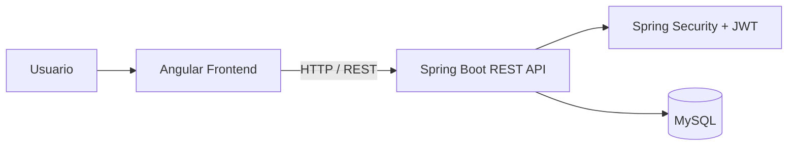
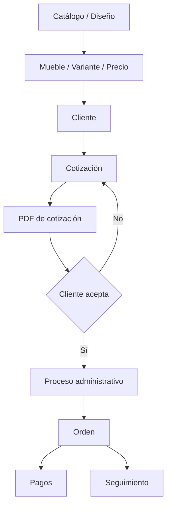
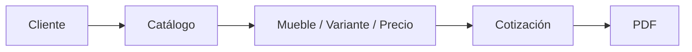
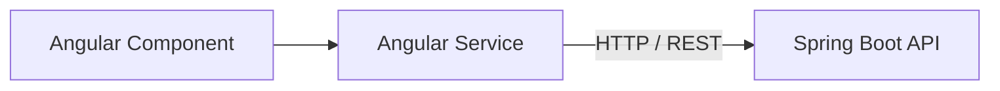

# ERP Mueblerías Kuko — Frontend

Aplicación web desarrollada con **Angular** que funciona como interfaz de usuario de **ERP Mueblerías Kuko**, un sistema creado para digitalizar y centralizar procesos comerciales, financieros y operativos de una mueblería artesanal.

**Versión actual:** V1  
**Estado:** Funcional / En evolución  
**Backend:** Repositorio independiente

---

## Descripción

Este repositorio contiene exclusivamente el **frontend de ERP Mueblerías Kuko**.

La aplicación proporciona la interfaz para que distintos usuarios interactúen con los procesos del negocio de acuerdo con sus responsabilidades y permisos.

Actualmente permite trabajar con:

- **Clientes**
- **Catálogo**
- **Muebles y variantes de precio**
- **Cotizaciones**
- **Órdenes**
- **Pagos**
- **Egresos**
- **Usuarios**
- **Dashboard financiero y operativo**
- **Autenticación y navegación por roles**

El frontend consume una **API REST desarrollada con Spring Boot**, donde se encuentran la lógica de negocio, persistencia, autenticación y autorización real del sistema.

---

# Objetivo del frontend

El objetivo principal es proporcionar una interfaz web organizada y reutilizable para sustituir procesos administrativos que anteriormente dependían de registros manuales, libretas y posteriormente herramientas desarrolladas en **Excel con macros**.

La aplicación busca que la información pueda ser consultada y utilizada por diferentes miembros del área administrativa sin depender de una sola persona para acceder a los datos.

---

# Arquitectura general

El frontend forma parte de una arquitectura **cliente-servidor**.



El frontend es responsable principalmente de:

- Presentación de información.
- Navegación.
- Formularios.
- Validaciones de interfaz.
- Consumo de la API REST.
- Visualización según roles.
- Manejo del estado de la interfaz.
- Presentación de gráficas.
- Descarga de documentos.
- Experiencia de usuario.

> **Importante:** Las reglas de negocio críticas y la autorización real se encuentran en el backend.

---

# Stack tecnológico

| Tecnología | Versión / función |
|---|---|
| **Angular** | 21.2.x |
| **TypeScript** | 5.9.x |
| **RxJS** | 7.8.x |
| **Chart.js** | 4.5.x |
| **SweetAlert2** | 11.x |
| **Moment** | 2.30.x |
| **Angular Router** | Navegación |
| **Angular Guards** | Protección de rutas |
| **Angular SSR** | Configurado en el proyecto |
| **Express** | Soporte SSR |
| **CSS** | Diseño y estilos |

---

# Organización del proyecto

La aplicación está organizada separando responsabilidades mediante páginas, servicios, modelos, interfaces, guards, mappers, pipes, directivas, componentes compartidos y utilidades.

```text
src/app/
├── auth/
├── guards/
├── interface/
├── mappers/
├── models/
├── pages/
│   ├── catalogo/
│   ├── cliente/
│   ├── dashboard/
│   ├── egreso/
│   ├── grafica/
│   ├── listado-ordenes/
│   ├── listado-pagos-orden/
│   ├── mueble/
│   ├── presupuesto/
│   ├── tabla/
│   └── usuarios/
├── pipe/
├── services/
├── shared/
│   ├── directives/
│   ├── header/
│   ├── image-fallback/
│   ├── modal/
│   ├── search-box/
│   ├── sidebar/
│   ├── state/
│   └── utils/
├── type/
└── views-mapers/
```

## Responsabilidades principales

- **`auth/`** — autenticación e inicio de sesión.
- **`guards/`** — control de navegación por autenticación y roles.
- **`interface/`** — contratos utilizados por la aplicación.
- **`models/`** — modelos, DTOs, enums y requests.
- **`mappers/`** — transformación de información.
- **`services/`** — comunicación HTTP y lógica transversal.
- **`pages/`** — módulos funcionales.
- **`shared/`** — componentes y utilidades reutilizables.
- **`pipe/`** — transformaciones utilizadas en presentación.
- **`views-mapers/`** — transformación de datos orientada a vistas.

---

# Flujo comercial principal

La interfaz acompaña el proceso comercial desde la consulta de un diseño hasta la administración posterior de una venta.



---

# Autenticación

La aplicación utiliza autenticación basada en **JSON Web Tokens (JWT)** proporcionados por el backend.

El flujo general es:

```text
Login
  ↓
API REST
  ↓
JWT
  ↓
Sesión frontend
  ↓
Guards
  ↓
Navegación según permisos
```

Después de un inicio de sesión correcto, el frontend conserva localmente la información necesaria para mantener la sesión de interfaz.

Actualmente se utiliza **localStorage** para conservar información relacionada con la sesión.

> La validación criptográfica del JWT y la autorización real de las operaciones se realizan en el backend mediante **Spring Security**.

---

# Control de acceso por roles

La V1 trabaja con tres roles:

- **ADMIN**
- **VENDEDOR**
- **USER**

El frontend adapta la navegación, páginas y acciones disponibles según el usuario autenticado.

---

## ADMIN

El administrador dispone de acceso a los módulos administrativos del sistema.

Entre ellos:

- **Dashboard**
- **Clientes**
- **Catálogo**
- **Muebles y precios**
- **Cotizaciones**
- **Órdenes**
- **Pagos**
- **Egresos**
- **Usuarios**
- **Seguimiento financiero**
- **Seguimiento operativo**

---

## VENDEDOR

El rol **VENDEDOR** está orientado principalmente a las actividades comerciales previas a la administración de una orden.

Puede:

- **Consultar clientes**
- **Crear clientes**
- **Modificar clientes**
- **Consultar catálogo**
- **Consultar muebles y precios**
- **Crear cotizaciones**
- **Generar y descargar cotizaciones en PDF**

No dispone de acceso administrativo a:

- **Dashboard**
- **Usuarios**
- **Egresos**
- **Pagos**
- **Gestión administrativa de órdenes**
- **Administración de precios/muebles**

---

## USER

El rol **USER** dispone principalmente de acceso limitado para:

- Consultar el catálogo.
- Visualizar diseños.
- Consultar fotografías disponibles.

---

# Guards y protección de rutas

El frontend utiliza **Angular Guards** para controlar la navegación.

Estos mecanismos permiten:

- Evitar acceso a determinadas páginas sin autenticación.
- Redirigir usuarios según el estado de sesión.
- Limitar páginas según rol.
- Mantener una navegación coherente con los permisos.

```text
Angular Guards
      ↓
Control de navegación
      ↓
Interfaz según rol
      ↓
API protegida por Spring Security
```

> Ocultar botones o páginas en Angular no se considera una medida de seguridad suficiente. Las operaciones sensibles también están restringidas desde el backend.

---

# Gestión de clientes

El módulo de clientes permite:

- **Crear clientes**
- **Consultar clientes**
- **Buscar registros**
- **Modificar información**
- **Consultar detalles**
- **Consultar órdenes relacionadas**
- **Ejecutar acciones según permisos**

El módulo utiliza componentes y modales para realizar operaciones sin perder el contexto de navegación.

---

# Catálogo

El catálogo funciona como una colección visual de diseños y referencias de muebles.

Incluye:

- **Listado de diseños**
- **Fotografías**
- **Búsqueda**
- **Filtros**
- **Consulta de detalles**
- **Gestión según permisos**
- **Activación/desactivación**
- **Relación con variantes de muebles**
- **Fallback visual cuando una imagen no está disponible**

El catálogo permite separar la **referencia visual del diseño** de las variantes comerciales y precios asociados.

---

# Muebles y variantes

El sistema diferencia entre un diseño visual y su información comercial.

El módulo permite trabajar con:

- **Muebles**
- **Variantes**
- **Precios**
- **Relación con diseños**
- **Búsqueda**
- **Consulta de información comercial**
- **Operaciones administrativas según permisos**

El vendedor puede consultar esta información para elaborar cotizaciones, mientras que la administración de muebles y precios está restringida.

---

# Cotizaciones

El módulo permite construir una cotización utilizando la información previamente registrada.

## Flujo de cotización

1. **Seleccionar o registrar un cliente.**
2. **Consultar el catálogo.**
3. **Seleccionar muebles y variantes.**
4. **Definir cantidades y precios correspondientes.**
5. **Validar la información.**
6. **Crear la cotización.**
7. **Solicitar la generación del documento.**
8. **Descargar el PDF.**
9. **Compartirlo con el cliente.**



La generación del PDF se realiza en el backend y el frontend permite solicitar y descargar el documento.

---

# Órdenes

El módulo administrativo de órdenes permite visualizar información relacionada con las ventas registradas.

Entre los datos presentados se encuentran:

- **Folio**
- **Cliente**
- **Fecha**
- **Fecha de entrega**
- **Importe**
- **Estado de la orden**
- **Estado del proceso**
- **Estado de pago**
- **Estado de entrega**
- **Muebles relacionados**
- **Pagos asociados**

La interfaz también incorpora búsqueda y filtrado para localizar órdenes utilizando diferentes criterios.

---

# Pagos

El frontend proporciona una interfaz para consultar y administrar movimientos relacionados con órdenes.

Incluye:

- **Listado**
- **Registro**
- **Actualización**
- **Cancelación**
- **Búsqueda**
- **Filtros**
- **Consulta de detalles**
- **Estado del movimiento**
- **Total aplicado**
- **Acceso a la orden relacionada**

> Las reglas que determinan saldos y comportamiento financiero se ejecutan en el backend.

---

# Egresos

El módulo de egresos permite trabajar visualmente con las salidas de dinero registradas.

Incluye:

- **Listado**
- **Creación**
- **Actualización**
- **Cancelación**
- **Consulta de detalles**
- **Búsqueda**
- **Filtros**
- **Formas de pago**

Los egresos son utilizados posteriormente por el backend para calcular indicadores financieros.

---

# Dashboard

El dashboard concentra información financiera y operativa mediante **indicadores, tablas y gráficas**.

## Períodos disponibles

La interfaz permite consultar:

- **Día actual**
- **Semana**
- **Mes**
- **Intervalo personalizado**

---

## Indicadores principales

La V1 presenta información relacionada con:

- **Ventas**
- **Ingresos**
- **Egresos**
- **Balance**
- **Saldo pendiente**
- **Órdenes activas**
- **Estado de cobranza**
- **Seguimiento de órdenes**

---

## Visualización financiera

El frontend utiliza **Chart.js** para representar información financiera.

Entre las visualizaciones se encuentran:

- **Ingresos**
- **Egresos**
- **Balance**

Esto permite observar el comportamiento financiero durante el período seleccionado.

---

## Estado de cobranza

La interfaz presenta información relacionada con:

- **Total vendido**
- **Total cobrado**
- **Total pendiente**
- **Porcentaje de cobranza**

Los cálculos son realizados por el backend y posteriormente representados por Angular.

---

## Seguimiento de órdenes

El dashboard también permite visualizar indicadores relacionados con:

- **Órdenes pendientes**
- **Órdenes en producción**
- **Órdenes listas para entrega**
- **Órdenes atrasadas**
- **Próximas entregas**

---

# Componentes reutilizables

Durante el desarrollo se crearon elementos compartidos para reducir duplicación y mantener una experiencia consistente.

Entre ellos:

- **Header**
- **Sidebar**
- **Modales**
- **Search box**
- **Menús contextuales**
- **Estados de carga**
- **Estados de error**
- **Estados vacíos**
- **Fallback de imágenes**
- **Directivas**
- **Pipes**
- **Utilidades**

---

# Manejo reactivo con RxJS

**RxJS** se utiliza para manejar comunicación asíncrona y diferentes estados de la aplicación.

Entre las herramientas utilizadas se encuentran:

- **`Subject`**
- **`BehaviorSubject`**
- **`finalize`**
- **Debounce de búsquedas**

También se utilizan herramientas del ciclo de vida de Angular, incluyendo **`DestroyRef`**, para gestionar recursos y suscripciones.

---

# Comunicación HTTP

La comunicación con el backend está centralizada principalmente mediante servicios.



El token Bearer se incorpora actualmente desde los servicios que requieren autenticación.

Como mejora técnica futura se contempla centralizar esta responsabilidad mediante un **HTTP Interceptor**.

---

# Gestión de imágenes

La interfaz permite trabajar con fotografías asociadas al catálogo.

El frontend se encarga de:

- **Mostrar imágenes**
- **Seleccionarlas durante operaciones permitidas**
- **Presentar referencias visuales**
- **Gestionar estados cuando una imagen no está disponible**

El almacenamiento y procesamiento principal corresponde al backend.

---

# Generación y descarga de documentos

La aplicación permite solicitar y descargar documentos generados por el backend.

Actualmente se utilizan documentos PDF asociados a:

- **Cotizaciones**
- **Órdenes**

Esto permite transformar la información del ERP en documentos utilizables fuera de la aplicación.

---

# Configuración del entorno

Durante desarrollo, el frontend utiliza una ruta base local similar a:

```text
http://localhost:8080/api/v1
```

Esta dirección es únicamente una ruta local y **no contiene credenciales ni secretos**.

Las credenciales de base de datos, secretos JWT y demás configuración privada pertenecen al backend.

---

# Ejecución local

## Requisitos

- **Node.js**
- **npm**
- **Angular CLI**

## Instalar dependencias

```bash
npm install
```

## Ejecutar servidor de desarrollo

```bash
npm start
```

También puede utilizarse:

```bash
ng serve
```

La aplicación estará disponible normalmente en:

```text
http://localhost:4200
```

Para utilizar todas las funcionalidades es necesario tener disponible la **API backend**.

---

#  Scripts disponibles

```bash
npm start
npm run build
npm run watch
npm test
```

El proyecto también cuenta con configuración para **Angular SSR**.

---

# Capturas del sistema

> **Nota:** Las capturas destinadas a GitHub y portafolio deben utilizar información ficticia o anonimizada.

## Login

<!--

-->

## Dashboard

<!--

-->

## Clientes

<!--

-->

## Catálogo

<!--

-->

## Muebles

<!--

-->

## Cotizaciones

<!--

-->

## Órdenes

<!--

-->

## Pagos

<!--

-->

---

# Principales aprendizajes

El desarrollo del frontend permitió aplicar de forma práctica:

- **Arquitectura de aplicaciones Angular**
- **Separación por responsabilidades**
- **TypeScript**
- **Consumo de APIs REST**
- **Integración con JWT**
- **Angular Guards**
- **Control de interfaz basado en roles**
- **RxJS**
- **Formularios**
- **Componentes reutilizables**
- **Modales**
- **Pipes**
- **Directivas**
- **Manejo de imágenes**
- **Descarga de documentos**
- **Chart.js**
- **Estados de carga, error y vacío**
- **Búsquedas con debounce**
- **Ciclo de vida de Angular**
- **DestroyRef**
- **finalize**
- **Transformación de DTOs y modelos para presentación**

Uno de los principales aprendizajes fue transformar **procesos empresariales reales** en flujos de interfaz que pudieran ser utilizados por usuarios con diferentes responsabilidades.

---

#  Roadmap

##  V1

La primera versión funcional incluye:

- **Login**
- **Control de sesión**
- **Navegación según rol**
- **Clientes**
- **Catálogo**
- **Muebles y variantes**
- **Cotizaciones**
- **Descarga de PDF**
- **Órdenes**
- **Pagos**
- **Egresos**
- **Usuarios**
- **Dashboard**
- **Indicadores financieros**
- **Seguimiento de órdenes**
- **Visualización mediante gráficas**

---

##  V1.1

Mejoras planeadas:

- **Depuración general**
- **Paginación del listado de órdenes**
- **Paginación de egresos**
- **Paginación de pagos**
- **Nueva gráfica para dashboard**
- **Mejoras de interfaz**
- **Refactorizaciones y optimizaciones**
- **Evaluar centralización de autenticación mediante HTTP Interceptor**

---

##  Futuras versiones

El frontend evolucionará junto con las nuevas funciones del ERP.

Entre las funcionalidades contempladas para el sistema se encuentran:

- **Administración de inventario**
- **Control y formato de pagos a trabajadores**
- **Mayor seguimiento de producción**
- **Nuevos indicadores administrativos y financieros**
- **Automatización adicional de procesos internos**

---

#  Backend

Este repositorio contiene únicamente el **frontend**.

La API REST de **ERP Mueblerías Kuko** se encuentra en un repositorio independiente desarrollado con:

- **Java 21**
- **Spring Boot 3.3.4**
- **Spring Security**
- **JWT**
- **Spring Data JPA**
- **MySQL**

**Repositorio backend:** pendiente de enlace público.

---

#  Alcance actual

La V1 prioriza los procesos administrativos, comerciales y financieros actualmente implementados.

La existencia de determinados estados en la interfaz no implica necesariamente que todos sus cambios estén automatizados.

Las automatizaciones adicionales relacionadas con producción y entrega forman parte de la evolución futura del ERP.

---

#  Autor

**Andrei Cañedo**

**GitHub:** [@AndreiCanedo](https://github.com/AndreiCanedo)

Proyecto desarrollado como solución para una necesidad empresarial real y como parte de mi desarrollo profesional en **ingeniería de software y automatización de procesos**.

---

#  Uso del proyecto

Este frontend fue desarrollado específicamente como parte de **ERP Mueblerías Kuko**.

El código fuente, información comercial, fotografías, diseños y demás recursos relacionados con el negocio **no se consideran de libre uso salvo autorización expresa**.
